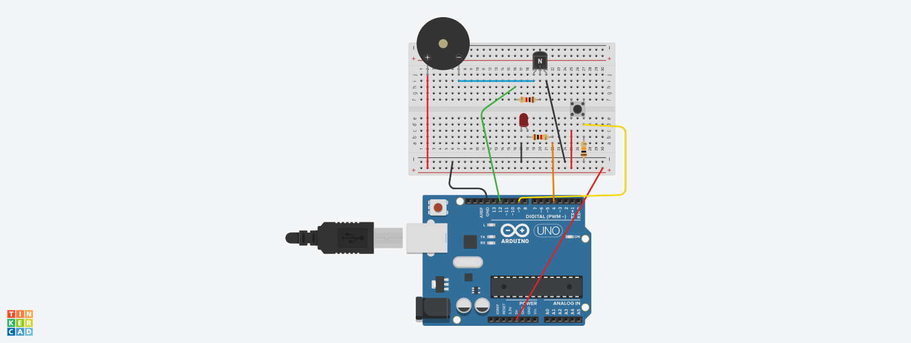

# Arduino LED & Buzzer Combo
This project controls a Red LED and an Active Buzzer simultaneously using a pushbutton switch.

## 🚀 The Learning Journey
Initially, I had trouble with the Switch
* **Initial Switch circuit**: I used a complex cicuit that uses two **10 kΩ** resistors, one of them attached to one switch terminal,
the other attached to the **D9** pin.The other switch terminal being grounded.
* **Switch circuit fix**: I used a single **10kΩ** resistor between one switch terminal to connect it directly to ground (**Pull Down Resistor**)
so that when Switch not pressed it reads LOW. I used another jumper wire to connect the other terminal to **5V**
so that when switch is pressed it reads high.

Also, in TinkerCad the simulation showed a "blast" symbol because the current through pin **D12** reached **84.0 mA**. 
* **The Limit**: Arduino pins have a max rating of **40.0 mA**.
* **The Fix**: Added a **1 kΩ resistor** to the transistor base to safely limit current.

## The Logic
When push button is not pressed, LED is set to HIGH or it glows and Buzzer does not beep. 
When the push buttonn is pressed LED turns off and Buzzer beeps.

https://github.com/user-attachments/assets/b876af31-be1b-435e-9498-b1fa18ad483f

## 📁 Included Files
* **Buzzer_LED_Code.ino**: Arduino source code.
* **Buzzer_LED_Pic.png**: Visual diagram of actual Circuit in TinkerCad.
* **Arduino-LED-Buzzer_video.mp4**: Video of demonstration.
* **Arduino-LED-Buzzer_Circuit_diagram.jpeg**: Circuit diagram.
